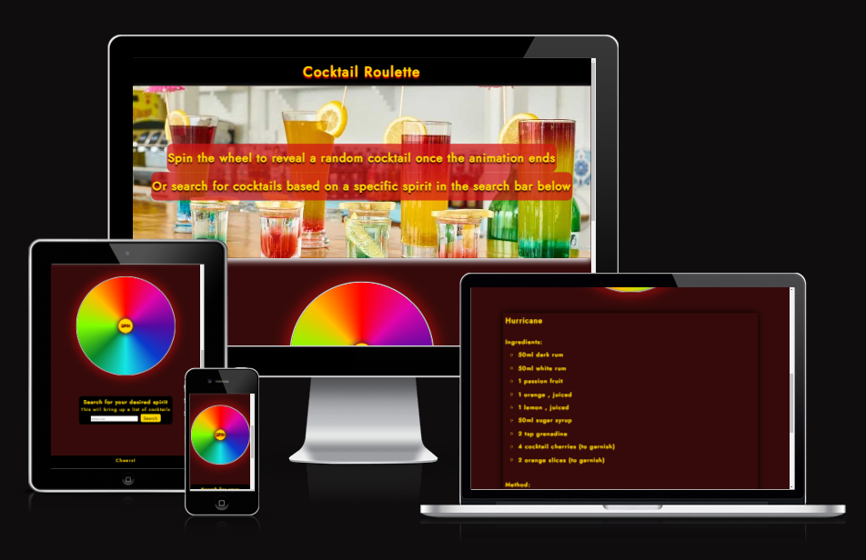
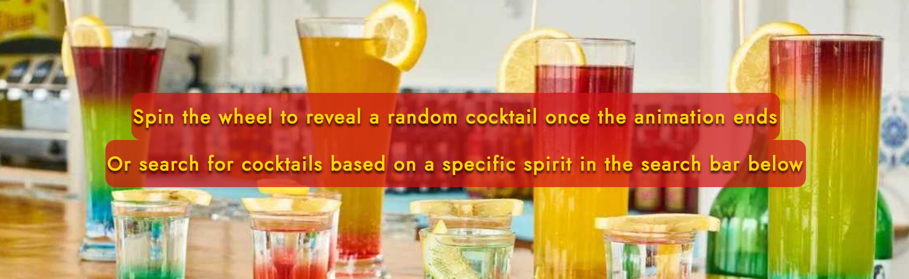
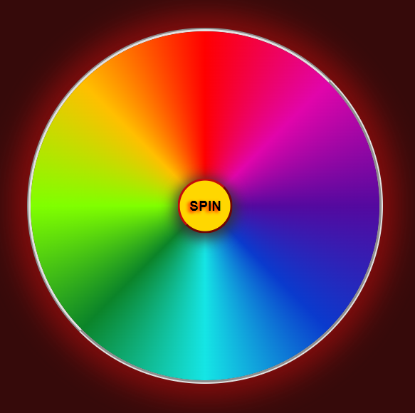
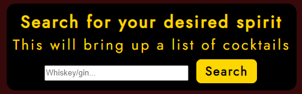
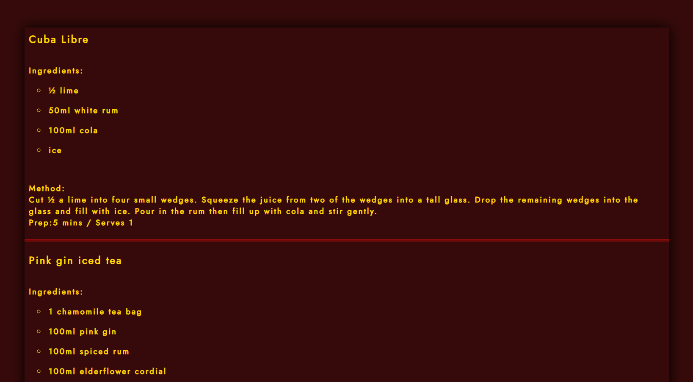
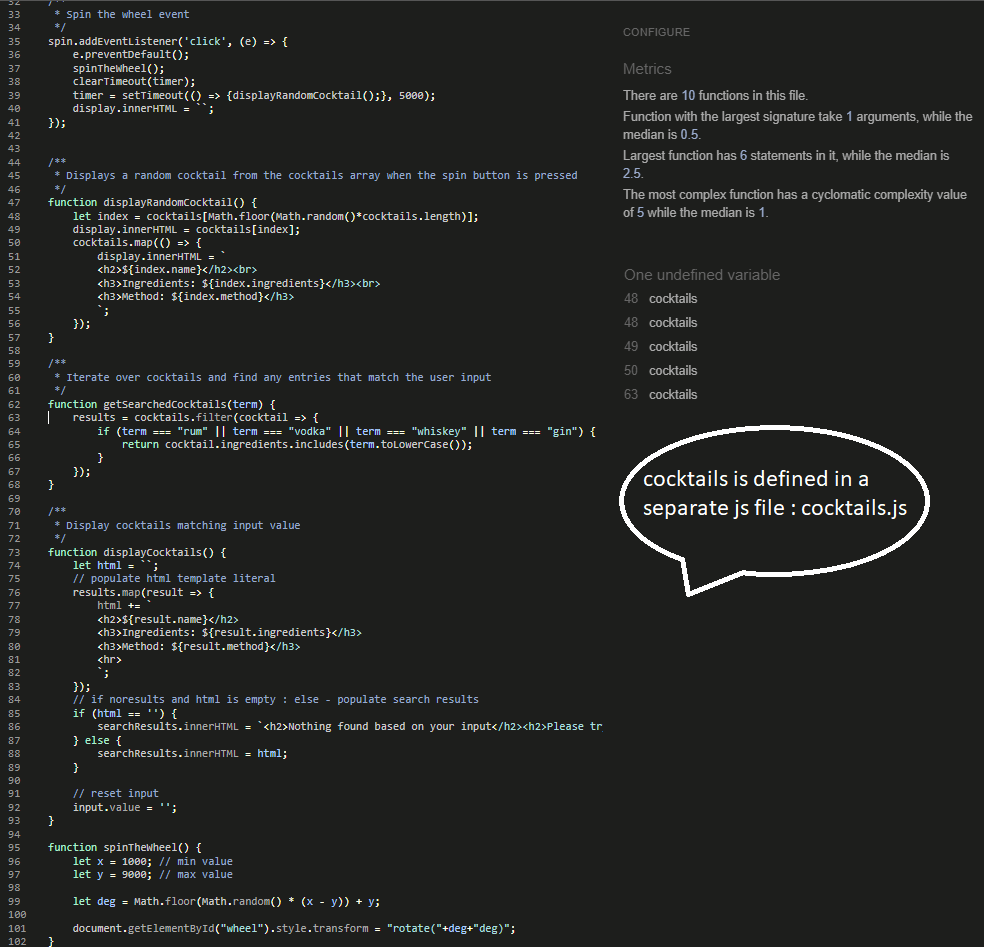
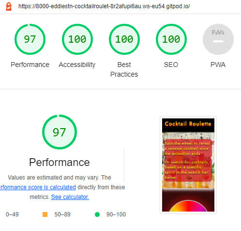
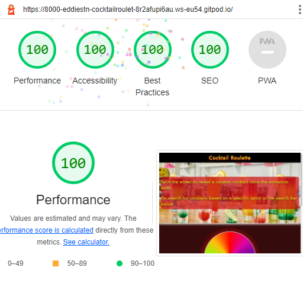

# Cocktail Roulette
## Cocktail roulette is a webpage built for every cocktail lover. When in doubt of your next drink or just looking to learn a new cocktail recipe, head on to cocktail roulette and have fun with the interactive spinning wheel that brings random cocktails in the spotlight, or search for spirit based ones.
Open the live webpage through this [link](https://eddiestn.github.io/cocktail-roulette/).



# Features
## Header with the page logo


## Hero
- The hero is also the web`s guide, explaining how the wheel works and what to use the search bar for.



## The wheel
- Once the **spin** button is clicked, the wheel spins for 5 seconds and then it displays a random cocktail.
- If the button is clicked again, the timer resets and waits for the animation to end before displaying the cocktail.
- When you spin the wheel again, the previous cocktail disappears. 



## Input section
- Here the user can search for all cocktails, based on a specific spirit input, eg. "rum" will display all cocktails containing rum.
- For an invalid input, the user will see a warning notice with the right input values.
- A new input generates a new list of cocktails and the previous one disappears



## Search result
Here is how the displayed cocktails section looks like. It is hidden by default and it is only displayed once triggered by the wheel or user input.



## Footer
The footer doesn`t consists of anything but a simple "Cheers" text


# Technology Used 
- HTML
- CSS
- Javascript

## Frameworks and Libraries 

   - [Google fonts](https://fonts.google.com/)
   - [Am I Responsive](https://ui.dev/amiresponsive)
   - [GitPod](https://gitpod.io/)
   - [GitHub](https://github.com/)

# Testing

## Validator testing

### HTMl W3C Validator
* No errors or warnings when passing through w3c validator. 
   * [html validator result](https://validator.w3.org/nu/?doc=https%3A%2F%2Feddiestn.github.io%2Fcocktail-roulette%2F).
### CSS JIGSAW
* No errors or warnings when passing through w3c css validator.
   * [css validator result](https://jigsaw.w3.org/css-validator/validator?uri=https%3A%2F%2Feddiestn.github.io%2Fcocktail-roulette%2F&profile=css3svg&usermedium=all&warning=1&vextwarning=&lang=en)
### JSHINT
* No errors or warnings when passing through jsHint.
   * cocktails.js is a separate file with 1 array of objects, no errors found.



### Lighthouse
- Mobile 



- Desktop



# Bugs
* spin button when clicked multiple times will not wait 5 seconds(setTimeout... 5000) before showing a cocktail
   * fixed by adding setTimeout and clearTimeout in a function;

* page load / page refresh would trigger setTimeout
   * fixed by setting a variable timer and in the function clearTimeout(timer) before timer = setTimeout(...5000)

      ```
      let timer;
      spin.addEventListener('click', (e) => {
         e.preventDefault();
         spinTheWheel();
         clearTimeout(timer);
         timer = setTimeout(() => {displayRandomCocktail();}, 5000);
         display.innerHTML = ``;
      });
      ```
* hero image will not display on github pages
   * the issue was absolute path on the url image, fixed with relative path;

# Local Development

## Forking and Cloning

## Forking a repository
### A fork is a copy of a repository. Forking a repository allows you to freely experiment with changes without affecting the original project.
1. On GitHub.com, navigate to the EddieStn/cocktail-roulette repository.
2. In the top-right corner of the page, click Fork.

## Cloning your forked repository
### Right now, you have a fork of the Cocktail-roulette repository, but you do not have the files in that repository locally on your computer.
1. On GitHub.com, navigate to your fork of the Cocktail-roulette repository.
2. Above the list of files, click Code.
3. Copy the URL for the repository.
4. Open Git Bash.
5. Change the current working directory to the location where you want the cloned directory.
6. Type git clone, and then paste the URL you copied earlier. It will look like this, with your GitHub username instead of YOUR-USERNAME:
   - git clone https://github.com/YOUR-USERNAME/Cocktail-roulette
7. Press Enter. Your local clone will be created.

# Deployment
### The site was deployed to GitHub pages. The steps to deploy are as follows:

- In the GitHub repository, navigate to the Settings tab
- From the Code and automation click on Pages
- From the source section drop-down menu, select the Master Branch and click Save
- Once the master branch has been selected, the page will be automatically refreshed with a detailed ribbon display to indicate the successful deployment.

The live link can be found here - (https://eddiestn.github.io/cocktail-roulette/)

# Credits 
## Media
* [hero image - pexels](https://www.pexels.com/photo/clear-drinking-glasses-2531188/)

# Acknowledgements

## Many thanks to my mentor, Chris Quinn, for his guidance
## Thank you Daniel_C_5p_lead and Daisy_mentor for helping me on my slack threads

# Sources

## Sites and courses that provided me with extra information and best practices to help build this project

* [code with mosh](https://codewithmosh.com/)
* [w3schools](https://www.w3schools.com/)
* [Slack](https://slack.com/intl/en-gb/)